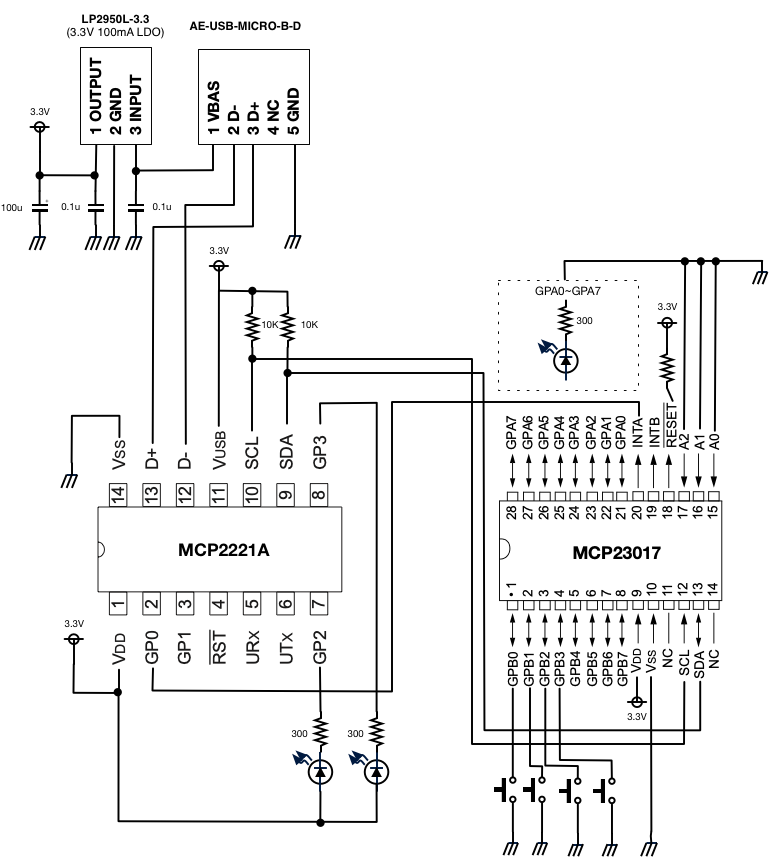
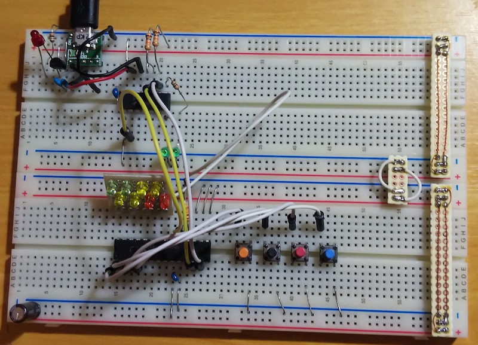

# MCP2221A + MCP23017

[libmcp2221](https://github.com/zkemble/libmcp2221) を使って、
Linuxから Go と C から利用するサンプルコードとライブラリです。
主に i2c からMCP23017を利用するための限定的なライブラリです。
カーネルのi2cドライバは使用しません。

* [libmcp2221のセットアップ](./libmcp2221/)
* [Goのライブラリとサンプル](./go)
* [Cのサンプル](./c)

ホストマシン: Linux(Debian 9)

# 回路図

# ビルドと実行

	$ cd libmcp2221
	$ sudo apt install libudev-dev libusb-1.0-0-dev
	$ make
	$ sudo make install
	$ cd ..

# LICENSE

GNU GPL v3
